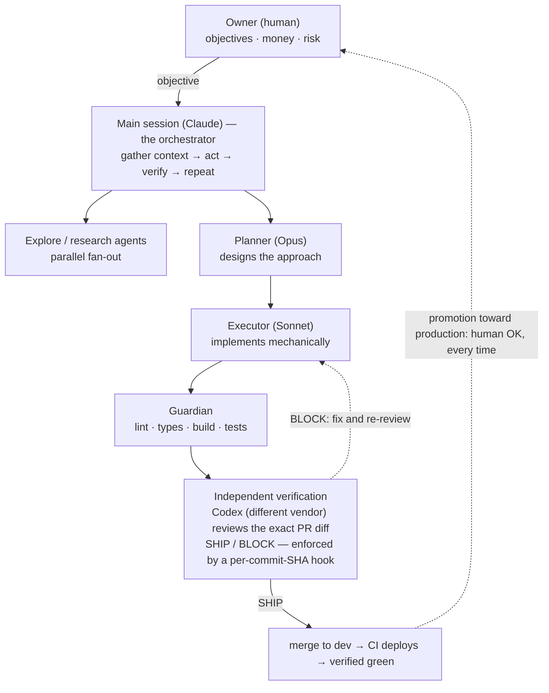

# Apollo Orchestration

> Named for **Apollo** — the dog who kept me company through countless 3am
> sessions and long nights of work. He was there for all of it, curled up
> nearby while this took shape. This repository carries his name in his memory.

How we build and operate a regulated Banking-as-a-Service platform with a team of one human and many AI agents — the orchestration model, the guardrails, and the lessons that shaped them.

This is a methodology write-up, not a framework. Everything documented here runs in production today: the platform moves real money, so every pattern below exists because something cheaper failed first. The excerpts are real configuration, sanitized.

## The shape of the system

One human owner sets objectives and holds the keys to anything involving money, customers, or production. Everything else — design, implementation, testing, review, deployment to the development environment — is delegated to an orchestrated set of AI agents running under Claude Code, with an independent second LLM vendor (OpenAI Codex) acting as the reviewer of record before any merge.

Three layers keep this safe:

1. **Norms** — a project constitution (`CLAUDE.md`) and persistent memory files that encode the rules and the scar tissue behind them.
2. **Structure** — specialized agents with narrow jobs, skills that encode domain playbooks, and engineering loops with measured baselines and bounded retries.
3. **Walls** — deterministic hooks that deny dangerous tool calls outright: no pushes to protected branches, no destructive SQL, no merge without a cross-vendor approval recorded for the exact commit SHA.

## A day in the life of a change

A typical non-trivial change flows like this:

1. The owner states an objective ("customers need X"). Ambiguity about the *goal* triggers one clarifying round; ambiguity about the *how* does not — technical calls belong to the AI.
2. The main session checks whether a **skill** covers the domain (migrations, webhooks, provider features…) and loads it before touching code, then fans out **explore agents** to map the relevant code in parallel.
3. A **planner agent** on the strongest model designs the approach; **executor agents** on a cheaper model implement it, in parallel where file ownership is disjoint.
4. A **guardian agent** validates lint, types, build, and tests after every meaningful batch of edits.
5. Verification is against the *actual job*, not proxies: a test that goes red→green, a call against the deployed function, a screenshot of the UI doing the thing. "Should work" is banned vocabulary.
6. A PR opens. In parallel with CI, **Codex — a different model vendor — reviews the exact diff** with a skeptical SHIP/BLOCK prompt. A merge-gate hook physically blocks the merge until a SHIP verdict is recorded for the PR's exact head commit; any new commit invalidates it.
7. Merge to the development branch *is* the deploy (CI/CD). The session reports back with evidence and stops at the hard stop: promoting toward customer-facing environments requires an explicit human OK, every time.

Total human involvement: the objective at the start, the promotion decision at the end, and any genuine business/risk calls in between.

## The chapters

| Chapter | What it covers |
|---|---|
| [01 — Principles](docs/01-principles.md) | The agentic loop contract, done-criteria, decision ownership, hard stops, the circuit breaker |
| [02 — Multi-LLM verification](docs/02-multi-llm-verification.md) | Why the doer never judges its own work; the cross-vendor SHIP/BLOCK gate and its per-SHA hook enforcement |
| [03 — Agents](docs/03-agents.md) | The agent roster, parallel fan-out, model routing economics, disjoint file ownership |
| [04 — Skills](docs/04-skills.md) | Domain playbooks the AI must load before working in a domain; what's worth encoding |
| [05 — Hooks as guardrails](docs/05-hooks-guardrails.md) | Deterministic policy enforcement: blocked destructive SQL, blocked direct deploys, merge gates |
| [06 — Memory](docs/06-memory.md) | Persistent per-project memory, the index/detail split, consolidation, incidents becoming rules |
| [07 — Engineering loops](docs/07-engineering-loops.md) | discover→plan→execute→verify→iterate campaigns with measured baselines and an independent judge |
| [08 — Lessons learned](docs/08-lessons-learned.md) | The failures that produced the rules — genericized war stories |
| [09 — Adoption guide](docs/09-adoption-guide.md) | Adopt this in a week — a staged path where every stage is independently valuable |
| [10 — State of the art (mid-2026)](docs/10-state-of-the-art-2026.md) | What a deep-research sweep validated, what we changed in response, and what we chose not to adopt |

## Copy-pasteable examples

The [`examples/`](examples/) directory contains genericized, directly usable versions of the real configuration:

| Directory | Contents |
|---|---|
| [`examples/claude-md/`](examples/claude-md/) | A project-constitution template (`CLAUDE.md`) distilled from the production one — kept small (~200 lines) on purpose |
| [`examples/rules/`](examples/rules/) | Path-scoped rules that auto-load only when a matching file is read — how the constitution stays small |
| [`examples/hooks/`](examples/hooks/) | The guardrail hooks: protected-branch pushes, destructive SQL, deploy bypasses, and the cross-vendor merge gate |
| [`examples/agents/`](examples/agents/) | The five agent definitions: orchestrator, guardian, loop planner/executor/verifier |
| [`examples/skills/`](examples/skills/) | A skill template plus two complete playbooks (safe migrations, webhook systems) |
| [`examples/codex-review-rubric.md`](examples/codex-review-rubric.md) | The rules-based rubric that hardens the cross-vendor SHIP/BLOCK review |
| [`examples/loops/`](examples/loops/) | Immutable feature lists + a fail-closed checker for long-horizon, multi-session work |
| [`examples/memory/`](examples/memory/) | The memory system: index template and one-fact-per-file memory examples |

## The principles in one paragraph

Give the AI a clear objective and full technical autonomy inside hard walls. Make "done" verifiable by command, never by opinion. Never let the model that wrote the code judge whether it merges — use a different vendor and enforce the verdict with a deterministic hook, not a promise. Encode every lesson where it can't be forgotten: incidents become memories, memories become rules, and the worst ones become hooks. Spend strong-model tokens on design and judgment, cheap-model tokens on mechanical execution, and human attention only where money, customers, or irreversibility are involved.

## What this is not

- Not a framework or library — the only things to install are the sanitized configs in [`examples/`](examples/), and those are starting points, not dependencies.
- Not a claim that this is the only way — it's the way that survived contact with a production financial system.
- Not the full configuration of our platform — excerpts are sanitized and simplified; platform-identifying details are deliberately absent.

## License

Documentation released under the [MIT License](LICENSE).
