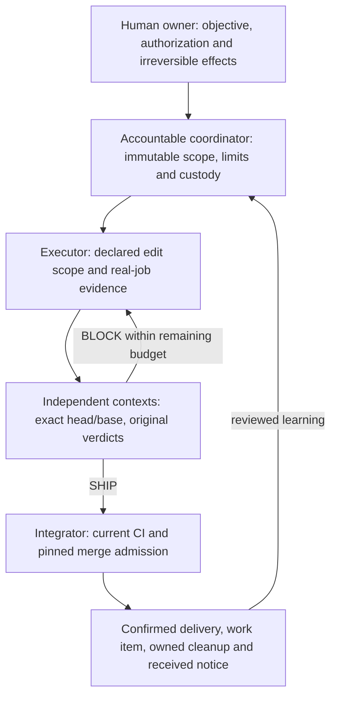

# Apollo 2.0 — Responsible AI Software Development Standard


> Named for **Apollo** — the dog who kept me company through countless 3am
> sessions and long nights of work. He was there for all of it, curled up
> nearby while this took shape. This repository carries his name in his memory.

Apollo 2.0 is a public, project-independent standard for responsible AI-assisted
software development. It specifies finite execution, accountable custody,
independent exact-head/base review, verified completion and reviewed learning.
No particular application, provider, board service or agent harness is required.

[Chapter 12](docs/12-apollo-2-standard.md) is normative. Chapters 01–11 describe
an informative historical case study from a regulated software platform. Their
vendor choices, orchestration patterns and marker-only approval examples are
superseded where they conflict with version 2.0. The new standard and reference
package are not claimed to be running in production or controlling live delivery.

## Reproduce local conformance

Requires Python 3.10+; no package installation or provider credentials:

```sh
python3 -m unittest discover -s examples/fleet -p 'test_*.py' -v
python3 examples/fleet/validate.py --help
```

[The portable reference](examples/fleet/README.md) tests two conspicuously
synthetic projects and adverse evidence states. It validates local attestations;
it does not run a Fleet, approve a PR, verify backend model identity or prove
remote delivery. Its coverage table names every runtime responsibility still
owned by the integrator. The conformance workflow runs these checks and existing
dependency-free Node ratchet and feature-immutability tests; a green result is
limited to those commands. The CRAP example additionally requires TypeScript
and is outside this no-install workflow.

## The control model


```mermaid
flowchart TB
    Owner["Human owner: objective, authorization and irreversible effects"]
    Coordinator["Accountable coordinator: immutable scope, limits and custody"]
    Executor["Executor: declared edit scope and real-job evidence"]
    Reviewer["Independent contexts: exact head/base, original verdicts"]
    Admission["Integrator: current CI and pinned merge admission"]
    Closure["Confirmed delivery, work item, owned cleanup and received notice"]
    Owner --> Coordinator
    Coordinator --> Executor
    Executor --> Reviewer
    Reviewer -->|SHIP| Admission
    Reviewer -->|BLOCK within remaining budget| Executor
    Admission --> Closure
    Closure -->|reviewed learning| Coordinator
```

Use one executor by default, bounded disjoint parallelism when justified, and
one independent review for routine changes or two for sensitive changes. Keep
configured development models and normal approvals. Provider diversity may be
a project risk choice; the author cannot be its own reviewer regardless of vendor.
Unknown effects require inspection, never blind replay or renewed spent credit.
A source verdict alone cannot establish a live lifecycle's completion.

## The chapters

| Chapter | What it covers |
|---|---|
| [01 — Principles](docs/01-principles.md) | The agentic loop contract, done-criteria, decision ownership, hard stops, the circuit breaker |
| [02 — Multi-LLM verification](docs/02-multi-llm-verification.md) | Historical cross-vendor and marker-only approval design, superseded by version 2.0 |
| [03 — Agents](docs/03-agents.md) | The agent roster, parallel fan-out, model routing economics, disjoint file ownership |
| [04 — Skills](docs/04-skills.md) | Domain playbooks the AI must load before working in a domain; what's worth encoding |
| [05 — Hooks as guardrails](docs/05-hooks-guardrails.md) | Deterministic policy enforcement: blocked destructive SQL, blocked direct deploys, merge gates |
| [06 — Memory](docs/06-memory.md) | Persistent per-project memory, the index/detail split, consolidation, incidents becoming rules |
| [07 — Engineering loops](docs/07-engineering-loops.md) | discover→plan→execute→verify→iterate campaigns with measured baselines and an independent judge |
| [08 — Lessons learned](docs/08-lessons-learned.md) | The failures that produced the rules — genericized war stories |
| [09 — Adoption guide](docs/09-adoption-guide.md) | Adopt this in a week — a staged path where every stage is independently valuable |
| [10 — State of the art (mid-2026)](docs/10-state-of-the-art-2026.md) | What a deep-research sweep validated, what we changed in response, and what we chose not to adopt |
| [11 — Testing and code health](docs/11-testing-and-code-health.md) | Why coverage alone is a bad risk signal, the CRAP metric, the ratchet rules that keep a quality gate alive, why authorization tests pass for the wrong reason, the test pyramid as a decision rule, TDD as the default |
| [12 — Apollo 2.0 standard](docs/12-apollo-2-standard.md) | Normative controls, acceptance evidence, failure actions and integration limits |

## Reference and historical examples

| Directory | Status and contents |
|---|---|
| [`examples/fleet/`](examples/fleet/) | Version 2.0 local evidence validator, synthetic fixtures, adversarial tests and exact coverage boundary |
| [`examples/hooks/`](examples/hooks/) | Historical guardrails; marker-only approval helpers retired, no live version 2.0 merge adapter supplied |
| [`examples/claude-md/`](examples/claude-md/) | Adaptable project constitution with bounded ownership and independent review requirements |
| [`examples/agents/`](examples/agents/) | Informative role examples; adapt vendor/model pins and contracts to protected project policy |
| [`examples/rules/`](examples/rules/) and [`examples/skills/`](examples/skills/) | Historical path rules and domain playbooks |
| [`examples/codex-review-rubric.md`](examples/codex-review-rubric.md) | Adaptable behavioral review rubric; provider choice is optional |
| [`examples/loops/`](examples/loops/) | Immutable feature-list checker and runnable regression tests |
| [`examples/memory/`](examples/memory/) | Memory templates; promotion requires evidence and independent review |
| [`examples/quality/`](examples/quality/) | Risk/ratchet utilities and runnable Node tests |
| [`examples/database-tests/`](examples/database-tests/) | Domain-specific examples; the Python parity checker additionally requires PyYAML |

Marker-file existence is not independent approval. Do not install retired
helpers or copy the old inline merge checks. Live forge enforcement needs an
integrator's tested adapter and protected server-side required checks.

## How we know

Not every claim in this repository is backed by the same kind of evidence,
and pretending otherwise would undermine the ones that are. Each major
practice falls into one of three honesty classes:

- **Measured** — there is a number we can reproduce by re-running a command.
  Very little qualifies: the complexity and CRAP scores the risk gate
  computes, the lint-warning and escape-hatch baselines the ratchets compare
  against, the pass counts of the runnable specs in `examples/`, and the
  selftest results of the gates that ship one. These are reproducible because
  the tool that produces them is in this repo.
- **Incident-derived** — a specific failure produced the rule. This is the
  large majority of what is written here: the cross-vendor review gate and
  its per-SHA hook, the hook hardening, fail-closed everywhere, the memory
  system, disjoint file ownership between parallel agents, the constitution
  guard, replace-the-named-path over shipping a parallel panel, the
  ratchet-to-touched-code rule. Each exists because something cheaper failed
  first, and the write-ups name the failure rather than the principle.
  Incident-derived is strong evidence that a problem is real; it is *not*
  evidence that our fix is the best available one.
- **Untested opinion** — it seems right and we have not proven it. Model
  routing economics (strong model for design, cheap model for mechanical
  execution) is a judgement call we have never A/B'd. The specific numeric
  thresholds (CRAP 20/30, complexity 15, the ~150–200 line component
  guideline) are reasoned from reference points, not tuned against outcome
  data. The claim that the staged adoption path in chapter 09 is the *right*
  order is an opinion. So is most of the advice about what belongs in a skill
  versus a rule.

**The discipline that keeps this honest: never print a per-repo savings
number.** There is a standing temptation to write "this saved N hours" or
"cut costs by X%". We do not, and neither should anything generated from
this methodology, for a structural reason rather than a modest one: the
version of the work that was never built has no measurement. There is no
baseline to subtract from — no unbuilt platform to time, no counterfactual
team to compare against — so any such figure is fabricated by construction,
however carefully it is hedged. Report what a command outputs, report what
an incident cost, and leave the savings arithmetic to whoever has a real
control arm.

## Adoption limits

Read the normative controls, declare your project's policy and supported
capabilities, then collect genuine runtime evidence for each control you claim.
The supplied parser implements a documented subset. This standard is not a
certification, endorsement, compliance guarantee or measured savings claim.
The historical case study is illustrative, not a dependency or proof that every
new control has completed a live job.

## License

Documentation and examples are released under the [MIT License](LICENSE).
