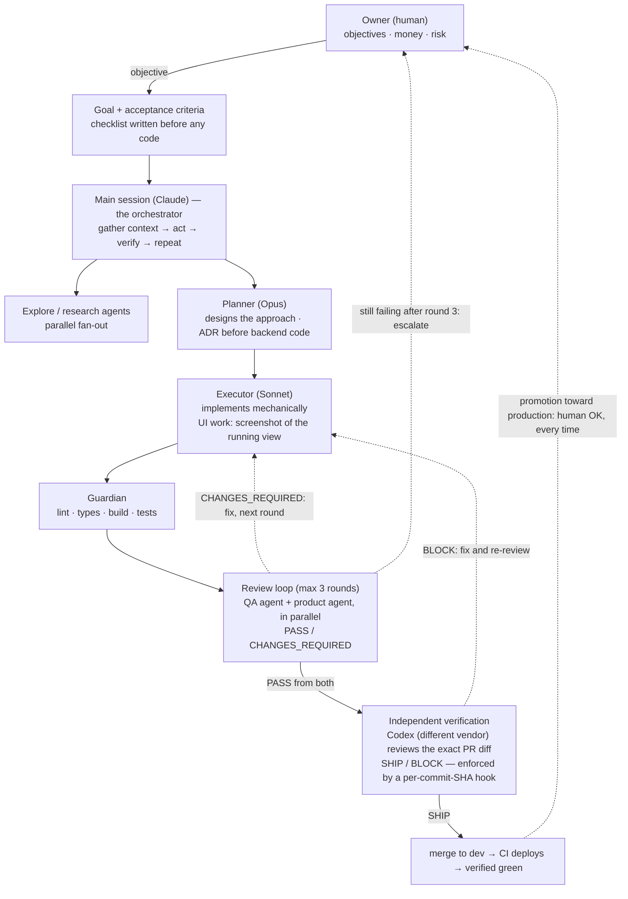

# Apollo Orchestration

> Named for **Apollo** — the dog who kept me company through countless 3am
> sessions and long nights of work. He was there for all of it, curled up
> nearby while this took shape. This repository carries his name in his memory.

How we build and operate a regulated Banking-as-a-Service platform with a team of one human and many AI agents — the orchestration model, the guardrails, and the lessons that shaped them.

This is a methodology write-up, not a framework. Everything documented here runs in production today: the platform moves real money, so every pattern below exists because something cheaper failed first. The excerpts are real configuration, sanitized.

## The shape of the system

One human owner sets objectives and holds the keys to anything involving money, customers, or production. Everything else — design, implementation, testing, review, deployment to the development environment — is delegated to an orchestrated set of AI agents running under Claude Code, with an independent second LLM vendor (OpenAI Codex) acting as the reviewer of record before any merge.

```mermaid
flowchart TB
    Owner["Owner (human)<br/>objectives · money · risk"]
    Goal["Goal + acceptance criteria<br/>checklist written before any code"]
    Main["Main session (Claude) — the orchestrator<br/>gather context → act → verify → repeat"]
    Explore["Explore / research agents<br/>parallel fan-out"]
    Planner["Planner (Opus)<br/>designs the approach · ADR before backend code"]
    Executor["Executor (Sonnet)<br/>implements mechanically<br/>UI work: screenshot of the running view"]
    Guardian["Guardian<br/>lint · types · build · tests"]
    Review["Review loop (max 3 rounds)<br/>QA agent + product agent, in parallel<br/>PASS / CHANGES_REQUIRED"]
    Verify["Independent verification<br/>Codex (different vendor) reviews the exact PR diff<br/>SHIP / BLOCK — enforced by a per-commit-SHA hook"]
    Merge["merge to dev → CI deploys → verified green"]

    Owner -->|objective| Goal
    Goal --> Main
    Main --> Explore
    Main --> Planner
    Planner --> Executor
    Executor --> Guardian
    Guardian --> Review
    Review -->|PASS from both| Verify
    Review -.->|"CHANGES_REQUIRED: fix, next round"| Executor
    Review -.->|"still failing after round 3: escalate"| Owner
    Verify -->|SHIP| Merge
    Verify -.->|BLOCK: fix and re-review| Executor
    Merge -.->|"promotion toward production: human OK, every time"| Owner
```

Three layers keep this safe:

1. **Norms** — a project constitution (`CLAUDE.md`) and persistent memory files that encode the rules and the scar tissue behind them.
2. **Structure** — specialized agents with narrow jobs, skills that encode domain playbooks, and engineering loops with measured baselines and bounded retries.
3. **Walls** — deterministic hooks that deny dangerous tool calls outright: no pushes to protected branches, no destructive SQL, no merge without a cross-vendor approval recorded for the exact commit SHA.

## A day in the life of a change

A typical non-trivial change flows like this:

1. The owner states an objective ("customers need X"). Ambiguity about the *goal* triggers one clarifying round; ambiguity about the *how* does not — technical calls belong to the AI.
2. The session writes the goal and its **acceptance criteria as a checklist** to `reviews/<feature>-goal.md` before touching code. Nothing downstream can declare done while a box is unchecked — this is the loop's success condition, not a formality. The loop can still *end* with boxes unchecked, but only by escalating to the owner, which is a failure exit rather than completion.
3. The main session checks whether a **skill** covers the domain (migrations, webhooks, provider features…) and loads it before touching code, then fans out **explore agents** to map the relevant code in parallel. Domain gates apply here: UI work loads the design and component-library skills and builds on existing primitives rather than hand-rolling; service, schema, and API work loads the backend and architecture skills and records the architecture decision in a **short ADR before implementation**.
4. A **planner agent** on the strongest model designs the approach; **executor agents** on a cheaper model implement it, in parallel where file ownership is disjoint.
5. A **guardian agent** validates lint, types, build, and tests after every meaningful batch of edits.
6. Verification is against the *actual job*, not proxies: a test that goes red→green, a call against the deployed function, a screenshot of the UI doing the thing. "Should work" is banned vocabulary, and UI work is never reported done without a screenshot of the running view.
7. A **review loop** runs before the PR — bounded at three rounds. Each round spawns two reviewers in parallel: a **QA agent** (correctness, edge cases, error states, accessibility) and a **product agent** (does this meet the acceptance criteria, is the flow usable). Where that expertise lives in skills rather than dedicated agent types, the rule names the skills each agent loads — naming a non-existent agent type produces a gate nobody can execute. Each writes its own report — `reviews/<feature>-round-N-qa.md` and `reviews/<feature>-round-N-product.md`, never a shared path, since two parallel writers would overwrite each other's verdict — with a verdict of `PASS` or `CHANGES_REQUIRED` and a numbered list of blocking issues. Any `CHANGES_REQUIRED` in round 1 or 2 sends the work back for a fix and another round; in round 3 there is no next round. The loop exits on `PASS` from both, or escalates to the owner with the open issues if round three still fails.
8. A PR opens. In parallel with CI, **Codex — a different model vendor — reviews the exact diff** with a skeptical SHIP/BLOCK prompt. A merge-gate hook physically blocks the merge until a SHIP verdict is recorded for the PR's exact head commit; any new commit invalidates it.
9. Merge to the development branch *is* the deploy (CI/CD). The session reports back with evidence and stops at the hard stop: promoting toward customer-facing environments requires an explicit human OK, every time.

Total human involvement: the objective at the start, the promotion decision at the end, and any genuine business/risk calls in between.

## The chapters

| Chapter | What it covers |
|---|---|
| [01 — Principles](docs/01-principles.md) | The agentic loop contract, done-criteria, decision ownership, hard stops, the circuit breaker |
| [02 — Multi-LLM verification](docs/02-multi-llm-verification.md) | Why the doer never judges its own work; the cross-vendor SHIP/BLOCK gate and its per-SHA hook enforcement |
| [03 — Agents](docs/03-agents.md) | The agent roster, parallel fan-out, model routing economics, disjoint file ownership |
| [04 — Skills](docs/04-skills.md) | Domain playbooks the AI must load before working in a domain; what's worth encoding |
| [05 — Hooks as guardrails](docs/05-hooks-guardrails.md) | Deterministic policy enforcement: blocked destructive SQL, blocked direct deploys, merge gates |
| [06 — Memory](docs/06-memory.md) | Persistent per-project memory, the index/detail split, consolidation, incidents becoming rules |
| [07 — Engineering loops](docs/07-engineering-loops.md) | discover→plan→execute→verify→iterate campaigns with measured baselines and an independent judge |
| [08 — Lessons learned](docs/08-lessons-learned.md) | The failures that produced the rules — genericized war stories |
| [09 — Adoption guide](docs/09-adoption-guide.md) | Adopt this in a week — a staged path where every stage is independently valuable |
| [10 — State of the art (mid-2026)](docs/10-state-of-the-art-2026.md) | What a deep-research sweep validated, what we changed in response, and what we chose not to adopt |
| [11 — Testing and code health](docs/11-testing-and-code-health.md) | Why coverage alone is a bad risk signal, the CRAP metric, the ratchet rules that keep a quality gate alive, why authorization tests pass for the wrong reason, the test pyramid as a decision rule, TDD as the default |

## Copy-pasteable examples

The [`examples/`](examples/) directory contains genericized, directly usable versions of the real configuration:

| Directory | Contents |
|---|---|
| [`examples/claude-md/`](examples/claude-md/) | A project-constitution template (`CLAUDE.md`) distilled from the production one — kept small (~200 lines) on purpose |
| [`examples/rules/`](examples/rules/) | Path-scoped rules that auto-load only when a matching file is read — how the constitution stays small |
| [`examples/hooks/`](examples/hooks/) | The guardrail hooks: protected-branch pushes, destructive SQL, deploy bypasses, the cross-vendor merge gate (including a hardened standalone `merge-gate.sh` with bypass-resistant command parsing), and a session-start hook that surfaces in-flight loops/plans so a restarted session has initiative, not just state |
| [`examples/agents/`](examples/agents/) | The five agent definitions: orchestrator, guardian, loop planner/executor/verifier |
| [`examples/skills/`](examples/skills/) | A skill template plus two complete playbooks (safe migrations, webhook systems) |
| [`examples/codex-review-rubric.md`](examples/codex-review-rubric.md) | The rules-based rubric that hardens the cross-vendor SHIP/BLOCK review |
| [`examples/loops/`](examples/loops/) | Immutable feature lists + a fail-closed checker for long-horizon, multi-session work |
| [`examples/memory/`](examples/memory/) | The memory system: index template and one-fact-per-file memory examples |
| [`examples/quality/`](examples/quality/) | The CRAP (Change Risk Anti-Patterns) risk metric plus two more ratchets — lint warnings and type-check escape hatches — with libraries, CLIs, specs, and the rules that keep each gate from being switched off; plus a guard for the project constitution itself, which pins its load-bearing rules and checks that its enforcement claims resolve to real, registered hooks |
| [`examples/database-tests/`](examples/database-tests/) | A runnable row-level-security suite showing the three ways an authorization test passes for the wrong reason, the CI job that runs it, and a parity checker replacing a comment that claimed an invariant nothing enforced |

## The principles in one paragraph

Give the AI a clear objective and full technical autonomy inside hard walls. Make "done" verifiable by command, never by opinion. Never let the model that wrote the code judge whether it merges — use a different vendor and enforce the verdict with a deterministic hook, not a promise. Encode every lesson where it can't be forgotten: incidents become memories, memories become rules, and the worst ones become hooks. Spend strong-model tokens on design and judgment, cheap-model tokens on mechanical execution, and human attention only where money, customers, or irreversibility are involved.

## How we know

Not every claim in this repository is backed by the same kind of evidence,
and pretending otherwise would undermine the ones that are. Each major
practice falls into one of three honesty classes:

- **Measured** — there is a number we can reproduce by re-running a command.
  Very little qualifies: the complexity and CRAP scores the risk gate
  computes, the lint-warning and escape-hatch baselines the ratchets compare
  against, the pass counts of the runnable specs in `examples/`, and the
  selftest results of the gates that ship one. These are reproducible because
  the tool that produces them is in this repo.
- **Incident-derived** — a specific failure produced the rule. This is the
  large majority of what is written here: the cross-vendor review gate and
  its per-SHA hook, the hook hardening, fail-closed everywhere, the memory
  system, disjoint file ownership between parallel agents, the constitution
  guard, replace-the-named-path over shipping a parallel panel, the
  ratchet-to-touched-code rule. Each exists because something cheaper failed
  first, and the write-ups name the failure rather than the principle.
  Incident-derived is strong evidence that a problem is real; it is *not*
  evidence that our fix is the best available one.
- **Untested opinion** — it seems right and we have not proven it. Model
  routing economics (strong model for design, cheap model for mechanical
  execution) is a judgement call we have never A/B'd. The specific numeric
  thresholds (CRAP 20/30, complexity 15, the ~150–200 line component
  guideline) are reasoned from reference points, not tuned against outcome
  data. The claim that the staged adoption path in chapter 09 is the *right*
  order is an opinion. So is most of the advice about what belongs in a skill
  versus a rule.

**The discipline that keeps this honest: never print a per-repo savings
number.** There is a standing temptation to write "this saved N hours" or
"cut costs by X%". We do not, and neither should anything generated from
this methodology, for a structural reason rather than a modest one: the
version of the work that was never built has no measurement. There is no
baseline to subtract from — no unbuilt platform to time, no counterfactual
team to compare against — so any such figure is fabricated by construction,
however carefully it is hedged. Report what a command outputs, report what
an incident cost, and leave the savings arithmetic to whoever has a real
control arm.

## What this is not

- Not a framework or library — the only things to install are the sanitized configs in [`examples/`](examples/), and those are starting points, not dependencies.
- Not a claim that this is the only way — it's the way that survived contact with a production financial system.
- Not the full configuration of our platform — excerpts are sanitized and simplified; platform-identifying details are deliberately absent.

## License

Documentation released under the [MIT License](LICENSE).
